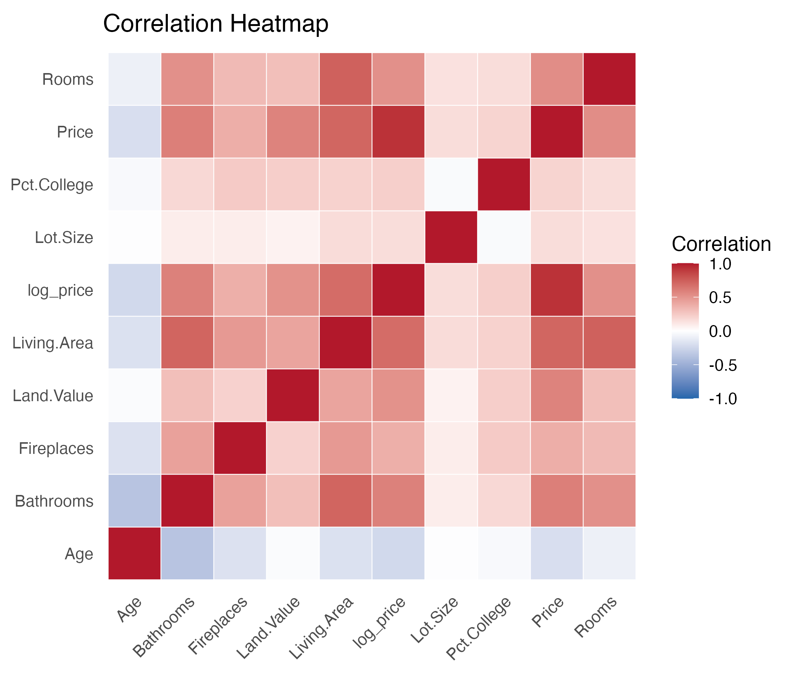
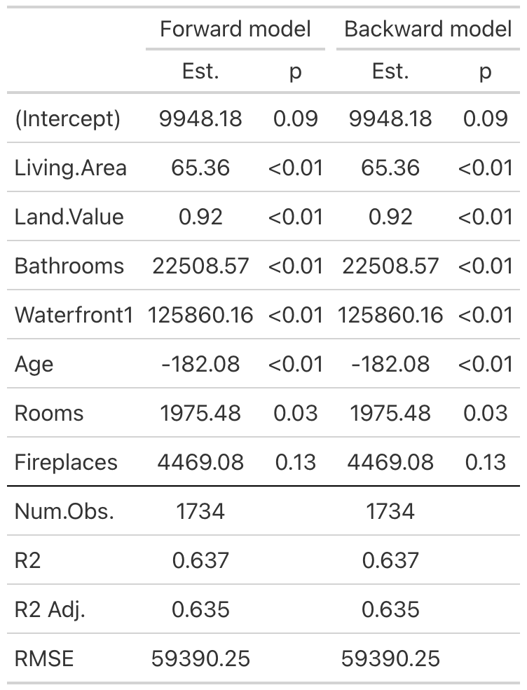
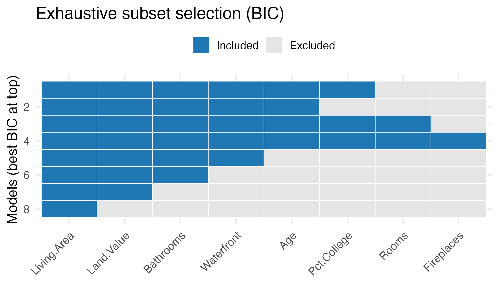
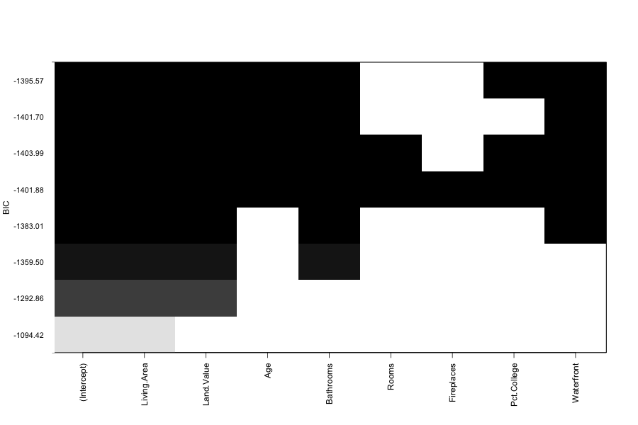
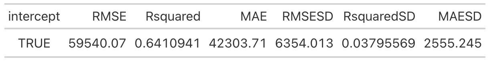
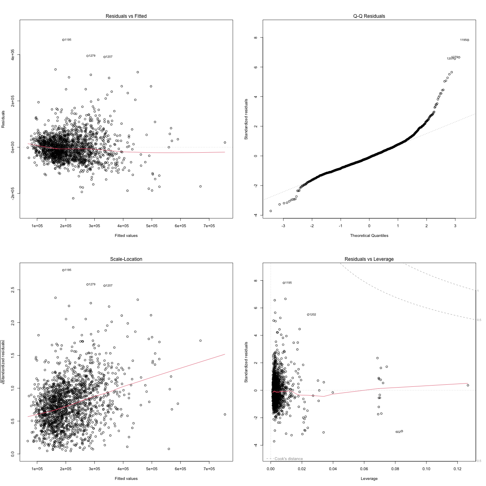
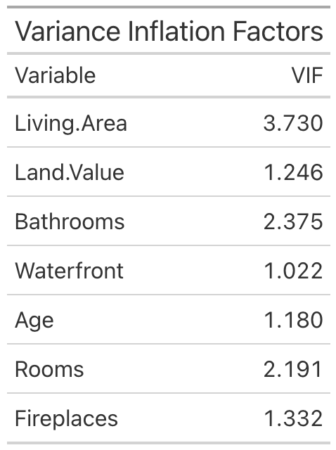

## Introduction 

Understanding what drives house prices is important for buyers and developers in New York. The diverse housing market, with large variation in property types and neighborhood amenities, offers interesting
insight. Our study asks: Which property and neighborhood factors best predict New York house prices, and how do model choices affect this? We examine multiple variables describing structural and socioeconomic 
features of each property. After exploratory analysis and processing, we fit and compare two predictive models: a transparent multiple linear regression for interpreting variable effects, and a random forest 
to capture potential non-linear relationships. The sections that follow outline the data and cleaning process, model specification and diagnostics, key results, and practical implications.


## Dataset
The dataset used in this study is a random sample of 1,734 residential properties drawn from the full Saratoga Housing Data (De Veaux, 2019), containing information on residential properties sold in Saratoga County, New York. Each observation includes 17 variables describing key property features and neighborhood characteristics. Key variables include:

- **Price**: sale price of the property in USD 
- **Living.Area**: interior living area in square feet
- **Pct.College**: proportion of neighborhood residents with a college degree
- **Bedrooms**: number of bedrooms
- **Bathrooms**: number of bathrooms
- **Land.Value**: assessed land value in USD
- **Age**: property age in years
- **Lot.Size**: total land area in square feet

## Analysis 
The aim of this analysis was to identify property and neighborhood features that best predict housing prices in New York. A structured multiple regression approach involving exploratory data analysis, systematic model selection, and assumption checking was used to identify the most influential predictors and evaluate how well they explain the variations in house prices. The analysis started with data cleaning and transformation. First, the data was cleaned to remove any missing or invalid entries. Key categorical variables (Waterfront, Central.Air and New.Construct) were converted into factors for appropriate treatment in regression modelling. Exploratory data analysis was performed to explore relationships between variables. The correlation heatmap (Appendix, Fig.1.) revealed strong positive correlations between Price and both Living.Area and Land.Value, moderate correlations with Bathrooms and Pct.College and a negative relationship with Age. These insights provided initial guidance on variables likely to influence house prices and informed subsequent regression modelling decisions.

Stepwise regression using the Akaike Information Criterion (AIC) was performed in both forward and backward directions to select a parsimonious and well-fitting model. Forward selection started with an empty model with only the intercept and sequentially added predictors that most improved AIC. Forward stepwise regression selected a model containing the variables Living.Area, Land.Value, Bathrooms, Waterfront, Age, Rooms and Fireplaces (Appendix Fig.2.). On the other hand, backward elimination started with a full model and iteratively eliminated variables if removing them improved AIC. Backward selection converged to an identical model with the same seven predictor variables (Appendix Fig.2.) indicating strong model stability.

To further validate the stepwise regression results and explore all possible variable combinations, an exhaustive subset selection was performed using the Bayesian Information Criterion (BIC). The best BIC model included the variables Living.Area, Land.Value, Bathrooms, Waterfront, Age and Pct.College (Appendix, Fig.3.). There are two notable differences between this model and the stepwise AIC model. Unlike the stepwise AIC models, the BIC model includes the variable Pct.College but excludes Rooms and Fireplaces. The exhaustive search heatmap (Appendix, Fig.3.) reveals that all the top-performing models consistently included Living.Area, Land.Value, Age, Bathrooms, and Waterfront. This highlights the strong influence of these variables as predictors of house prices. 

After comparing the models, the stepwise AIC model including seven predictor variables was chosen as the final regression model due to various reasons. Firstly, both the forwards selection and backwards elimination method converged to this model, displaying great model stability. Moreover, cross-validation results also confirmed excellent model generalisability with minimal overfitting. Overall, this model also maintained excellent interpretability, including predictors representing both property features as well as neighborhood characteristics.

Ten-fold cross-validation was performed to evaluate model performance and generalisability. The dataset was partitioned into ten equal subsets (folds), with nine folds used for training and one fold used for testing. The cross-validation results (Appendix, Fig.5.) showed that the model achieved:RMSE value of 59,540.07 (root mean squared error), $R^2$ of 0.641 (cross-validated coefficient of determination) and MAE of 42,304.71 (mean absolute error).

The cross-validated $R^2$(0.641) was very close to the training $R^2$(0.637), which indicates strong predictive performance, good generalisability to unseen data and minimal overfitting.

The final multiple linear regression model took the form:
\[
\begin{aligned}
\text{Price} = & \ 9948.18 + 65.36 \, (\text{Living.Area}) + 0.92 \, (\text{Land.Value}) \\
               & + 22508.57 \, (\text{Bathrooms}) + 125860.16 \, (\text{Waterfront}) \\
               & - 182.08 \, (\text{Age}) + 1975.48 \, (\text{Rooms}) + 4469.08 \, (\text{Fireplaces}) \\
               & + \epsilon
\end{aligned}
\]

The model explained approximately 63.7% of the variance in Price ($R^2 = 0.637$, $R^2_{\text{Adj.}} = 0.635$). The coefficients can be interpreted as follows:

- **Living.Area** ($\beta = 65.36$, $p < 0.01$): Each additional square foot of living area increases Price by \$65.36.
- **Land.Value** ($\beta = 0.92$, $p < 0.01$): Each additional dollar of land value increases price by \$0.92.
- **Bathrooms** ($\beta = 22508.57$, $p < 0.01$): Each additional bathroom significantly increases Price by \$22,508.57.
- **Waterfront** ($\beta = 125860.16$, $p < 0.01$): Waterfront houses increase price by \$125,860.16.
- **Age** ($\beta = -182.08$, $p < 0.01$): Every additional year of property age decreases price by \$182.08.
- **Rooms** ($\beta = 1975.48$, $p = 0.03$): Every additional room increases Price by \$1,975.48.
- **Fireplaces** ($\beta = 4469.08$, $p = 0.13$): Each additional fireplace increases Price by \$4,469.08; however, this effect is not statistically significant at $\alpha = 0.05$.

The final model was assessed for all key regression assumptions:

- **Linearity**: Residual vs. Fitted plot (Appendix, Fig.6.) displayed points randomly scattered around zero, confirming appropriate linear specification between the selected predictors and house prices.
- **Normality**: Q-Q plot (Appendix, Fig.6.) indicated that residuals followed an approximately normal distribution, with minor deviations in the upper tail suggesting limited influence of heavy outliers.
- **Independence**: The dataset consists of a random sample of properties drawn from the full Saratoga Housing dataset, which supports the independent observations assumption.
- **Homoscedasticity**: The Scale-Location plot showed consistent spread of residuals across the range of fitted values and confirmed that the assumption was satisfied.
- **Multicollinearity**: All Variance Inflation Factors (VIF) (Appendix, Fig.7.) remained below 5, indicating no substantial multicollinearity among the predictor variables.

Our analysis also tested a Random Forest model to explore non-linear relationships, particularly for Bathrooms. This revealed diminishing returns in price for properties with more than three bathrooms. However, the Random Forest model only explained 36.49% of the price variance which is significantly lower than the linear model ($R^2$=0.64). As a result, the regression model was preferred over the Random Forest model as it offered greater predictive performance and interpretability.

## Results 

After cleaning and transforming the data, the final dataset contained 1734 New York house prices. A combination of stepwise regression, multipole linear regression, random forest modelling, and cross-validation was used to identify key price drivers.

A stepwise model selection process was conducted that used both forward and backward AIC search. Both procedures highlighted similar models as they selected Living Area, Land Value, Age, Bathrooms, Waterfront, Rooms, Fireplaces.
The agreement between both directions suggest that these predictors consistently provide the strongest fitted model. This indicates that the selected features are strong contributors to predicting housing prices, rather than appearing due to randomness or noise.

Using the selected predictors, a multiple linear regression model was fitted. The model explained approximately 63.7 % of variance($R^2$ = 0.637) in housing prices, which indicates a strong predictive power for a housing dataset with many different property types. The effects of these predictors show that:

- Houses with larger living areas and higher land value sold for more.
- Properties with waterfronts carry the largest price premium.
- Older homes sell for less, reflecting how in the real-world house prices depreciate over time.
- Additional bathrooms and rooms increased value bur diminish returns were noticeable.
- Fireplaces had a small effect on price after other variables were accounted for.

Taken together, these estimates indicate that the final model captures the major structural predictors of housing prices with strong explanatory power. 

A Random Forest model was used to explore potential non-linear relations. With this model we captured diminishing returns in bathroom count. Prices increase significantly from 1.5 – 2.5 bathrooms but slowed down when testing more than 3 bathrooms. This model explained 37% of variance($R^2$ =  0.37) in housing prices. This shows that the random forest was less interpretable, making it difficult to understand of individual predictors on price. 

A 10-fold cross-validated linear regression was used to test how well the model works with other datasets. The cross-validation showed a stable performance which indicates that the linear model is not overfitting.

Overall, the results show that structural property features such as living area, land value, bathrooms, and waterfront access are the most important factors of affecting increase of housing prices. Neighbourhood features had a weaker influence once structural features were included. The final linear model provided the best accuracy and interpretability which explained 63% of variation in price.

## Discussion & Conclusion

The results collected show that living area and land value are the main drivers of New York house prices. In the final multiple linear regression model, both variables accounted for the most variation in housing prices. Neighbourhood features, such as college-educated residents or waterfront traits, add smaller price premiums if all predictors are taken into account. The age predictor had a negative effect on price reflecting depreciation of older houses. The random forest model supported the same ranking of predictors and highlighted some non-linear patterns. Ten-fold cross-validation showed stable predictive accuracy suggesting that the linear model generalises well. However, limitations are still present as the dataset does not include key predictors such as renovation quality, sale dates or location. These important influences will not be observed and price differences tied to those predictors will be left unexplained, limiting the model's predictive power. Including features like spatial data and time-based information would likely improve predictive accuracy. Overall, property size and land value explain most of price variation and the linear model remains the most effective and interpretable for understanding how individual predictors affect price.


\newpage
# Appendix {-}

```{r correlation_heatmap, echo=FALSE, fig.align='center', out.width='70%', fig.cap='Correlation heatmap illustrating the relationships among key housing variables.', fig.pos='H'}
# Correlation heatmap

```


```{r stepwise_table, echo=FALSE, fig.align='center', out.width='50%', fig.cap='Stepwise regression table summarising variable entry and removal.', fig.pos='H'}
# Stepwise selection summary

```


```{r exhaustive_heatmap, echo=FALSE, fig.align='center', out.width='70%',fig.cap='Exhaustive search heatmap showing model selection by criterion.', fig.pos='H'}
# Exhaustive search heatmap

```


```{r regsubsets_BIC, echo=FALSE, fig.align='center', out.width='70%', fig.cap= 'Model selection using the Bayesian Information Criterion (BIC).', fig.pos='H'}
# Best subsets using BIC

```


```{r cv_results, echo=FALSE, fig.align='center', out.width='70%', fig.cap='Cross-validation results comparing model performance across folds.', fig.pos='H'}
# Cross-validation results

```


```{r diagnostics, echo=FALSE, fig.align='center', out.width='70%', fig.cap='Diagnostic plots for assessing regression assumptions', fig.pos='H'}
# Diagnostic plots

```

```{r vif, echo=FALSE, fig.align='center', out.width='40%', fig.cap='Variance Inflation Factors (VIF) for detecting multicollinearity.', fig.pos='H'}
# Variance Inflation Factors

```

